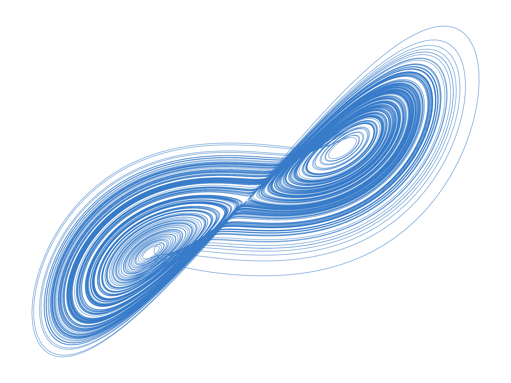

# <div align="center">
  
  
  # **Fourier Forecast**
  
  *AI-Powered Renaissance Daily Digest*
  
  [](https://www.python.org/)
  [](https://anthropic.com/)
  [](https://www.docker.com/)
  [](LICENSE)
</div>

---

## **What is Fourier Forecast?**

Fourier Forecast is a sophisticated AI-powered daily newsletter system that transforms the chaos of internet information into clear, actionable signals. Named after the Fourier transform—which decomposes complex signals into their constituent frequencies—this system identifies the fundamental "frequencies" of daily information: the recurring patterns, emerging trends, and underlying themes that matter most.

The logo, a Lorenz attractor (the famous "butterfly" from chaos theory), represents how seemingly random information flows can reveal beautiful, deterministic patterns when viewed through the right analytical lens. Just as Fourier analysis finds order in complex waveforms and the Lorenz system shows structure within chaos, Fourier Forecast discovers coherent signals within the daily information deluge.

The system delivers a personalized "Renaissance-style" breadth of knowledge every morning, curating high-signal information across multiple domains to foster polymathic thinking and cross-disciplinary insights.

### **Core Capabilities**

- **Multi-Source Content Aggregation**: Fetches content from academic papers (arXiv, **Semantic Scholar**), premium news sources (AP, Reuters, WSJ), RSS feeds, and specialized publications
- **7-Axis Renaissance Ranking**: AI evaluates content across dimensions including Temporal Impact, Intellectual Novelty, Cross-Domain Value, Actionable Wisdom, Source Authority, Signal Clarity, and Transformative Potential
- **4-Layer Intelligent Deduplication**: Combines URL matching, title hashing, semantic embeddings, and AI editorial judgment to ensure unique, high-value content
- **Cross-Sectional Synthesis**: Identifies "golden threads" connecting disparate stories and generates delightful insights
- **Section-Specific Editorial Voices**: Tailored summarization styles (historical for news, poetic for science, etc.)
- **Automated Daily Delivery**: Generates responsive HTML/plain-text emails delivered at 5:30 AM ET
- **Adaptive Content Caching**: Smart expiry based on content quality scores to balance novelty and relevance
- **Comprehensive Monitoring**: Performance metrics, error tracking, and deduplication statistics

## **Quick Start**

### Prerequisites

- Python 3.11 or higher
- Docker (optional, for containerized deployment)
- Required API Keys:
  - **Anthropic** (Claude) - Core AI reasoning
  - **LLMLayer** - Web search with citations
  - **Voyage AI** - Semantic embeddings
  - **Semantic Scholar** (optional, for higher academic paper limits) - Academic papers
  - **SMTP credentials** - Email delivery

### Installation

1. **Clone the repository**
   ```bash
   git clone https://github.com/Nacho2027/Ignacio-s-Fourier-Forecast.git
   cd Ignacio-s-Fourier-Forecast
   ```

2. **Set up environment variables**
   ```bash
   cp .env.example .env
   # Edit .env with your API keys and configuration
   ```

3. **Install dependencies**
   ```bash
   pip install -r requirements.txt
   ```

4. **Run the newsletter generator**
   ```bash
   # Run once immediately
   python src/main.py --once
   
   # Run with dry-run (no email sent)
   python src/main.py --dry-run --once
   
   # Schedule daily execution at 5:00 AM ET
   python src/main.py
   ```

### Docker Deployment

For production deployment using Docker:

```bash
# Build and run with Docker Compose
docker-compose up --build

# Or use the convenience script
./docker-run.sh
```

## **System Architecture**

```
fourier-forecast/
├── src/
│   ├── main.py                           # Central orchestrator & scheduler
│   ├── deployment/                       # Deployment-specific utilities
│   │   └── validator.py                  # Deployment readiness validation
│   ├── pipeline/                         # Core pipeline stages
│   │   ├── content_aggregator.py         # Fetches & ranks content from all sources
│   │   └── email_compiler.py             # Generates final newsletter HTML/text
│   ├── services/                         # External integrations & business logic
│   │   ├── ai_service.py                 # Claude AI integration (ranking, summarization, etc.)
│   │   ├── llmlayer.py                   # Premium web search with citations
│   │   ├── arxiv.py                      # arXiv academic paper fetching
│   │   ├── semantic_scholar_service.py   # Peer-reviewed paper discovery (via direct API)
│   │   ├── rss.py                        # RSS feed aggregation (including USCCB)
│   │   ├── cache_service.py              # SQLite persistence & dedup tracking
│   │   ├── deduplication_service.py      # 4-layer deduplication logic
│   │   ├── summarization_service.py      # Section-specific summarization
│   │   ├── synthesis_service.py          # Golden thread & insight generation
│   │   └── email_service.py              # SMTP email delivery
│   └── utils/                            # Utility functions
│       ├── embeddings.py                 # Voyage AI semantic embeddings
│       ├── logging_config.py             # Centralized logging configuration
│       ├── error_monitoring.py           # Error classification & recovery
│       └── logo_embedder.py              # Logo embedding utilities
├── config/
│   └── prompts_v2.yaml                   # AI prompt templates & parameters
├── templates/
│   ├── newsletter.html.j2                # Responsive HTML email template
│   └── newsletter_plain.j2               # Plain text email fallback
├── assets/                               # Static assets (logos, images)
│   ├── fourier_forecast_logo_butterfly.png # Main logo (Lorenz attractor)
│   └── logo_base64.txt                   # Base64 encoded logo for email embedding
├── scripts/                              # Deployment and utility scripts
│   └── deploy.sh                         # Systemd deployment script
├── docker/                               # Docker-related files
│   └── entrypoint.sh                     # Docker container entrypoint
├── .dockerignore                         # Docker ignore patterns
├── .env.example                          # Environment variables template
├── .gitignore                            # Git ignore patterns
├── Dockerfile                            # Docker build instructions
├── docker-compose.yml                    # Docker Compose configuration
├── docker-run.sh                         # Docker convenience script
├── setup-docker.sh                       # Docker environment setup
├── run                                   # Simple script to run main.py
├── requirements.txt                      # Python dependencies
├── LICENSE                               # MIT License
└── README.md                             # Project overview and documentation
```

## **Data Flow & Pipeline Stages**

The daily pipeline executes at 5:00 AM ET with the following stages:

### 1. **Content Fetching** (Parallel)

The system aggregates content for the following newsletter sections:

- **Scripture & Reflection**: USCCB daily readings + Catholic daily reflections
- **Breaking News**: AP News, Reuters - major world events and developments
- **Business & Finance**: Wall Street Journal, Axios - markets, economics, corporate news
- **Technology & Science**: MIT Tech Review, IEEE Spectrum, Quanta Magazine - innovations and discoveries
- **Research Papers**: arXiv (AI/CS/Physics/Math) + **Semantic Scholar** - cutting-edge academic research
- **Startup Insights**: Y Combinator Blog, First Round Review - founder wisdom and venture trends
- **Politics**: Associated Press - non-partisan U.S. political coverage
- **Local News**: Miami Herald, Cornell/Ithaca news - regional developments
- **Miscellaneous**: Broad intellectual queries - philosophy, culture, unexpected insights
- **Extra**: Additional high-signal content that doesn't fit other categories

### 2. **Intelligent Deduplication**
- **Layer 1**: URL exact match (30-day window)
- **Layer 2**: Title hash similarity (7-day window)
- **Layer 3**: Semantic embedding similarity (cosine distance)
- **Layer 4**: AI editorial judgment for borderline cases

### 3. **Renaissance Ranking**
Each item scored on 7 dimensions:
- **Temporal Impact** (25%): Relevance and urgency
- **Intellectual Novelty** (20%): New insights and perspectives
- **Renaissance Breadth** (15%): Cross-domain connections
- **Actionable Wisdom** (15%): Practical applications
- **Source Authority** (10%): Credibility and expertise
- **Signal Clarity** (10%): Information quality
- **Transformative Potential** (5%): Paradigm-shifting ideas

### 4. **Content Selection**
- Dynamic quality thresholds per section
- Enforced minimums for balance
- Narrative flow optimization
- Diversity within sections

### 5. **Summarization**
- 25-40 word single-sentence summaries
- Section-specific editorial voices
- Preface paragraphs for context

### 6. **Synthesis**
- Identifies "golden thread" connecting stories
- Generates "delightful surprise" conclusion

### 7. **Email Compilation**
- Responsive HTML with inlined CSS
- Plain text fallback
- Subject line with teaser
- Source citations and reading time

### 8. **Delivery & Caching**
- SMTP delivery at 5:30 AM ET
- Adaptive cache expiry (7-30 days based on score)
- Newsletter manifest storage

## **Newsletter Output**

The final daily newsletter includes:

### Email Structure
- **Subject**: "Ignacio's Fourier Forecast — [Date] • [AI-generated teaser from golden thread]"
- **Greeting**: Personalized morning welcome
- **Golden Thread**: AI-identified theme connecting the day's stories
- **Newsletter Sections** (in order):
  1. Scripture & Reflection - Daily spiritual grounding
  2. Breaking News - Top global developments
  3. Business & Finance - Market and economic insights
  4. Technology & Science - Innovation and discovery
  5. Research Papers - Academic breakthroughs
  6. Startup Insights - Entrepreneurial wisdom
  7. Politics - U.S. political developments
  8. Local News - Regional updates
  9. Miscellaneous - Intellectual explorations
  10. Extra - Additional high-value content
- **Delightful Surprise**: Closing insight or quote
- **Footer**: Reading time and story count

## **Configuration**

### Environment Variables

Key configuration in `.env`:

```bash
# AI Services
ANTHROPIC_API_KEY=your_claude_api_key
LLMLAYER_API_KEY=your_llmlayer_api_key
VOYAGE_API_KEY=your_voyage_api_key
SEMANTIC_SCHOLAR_API_KEY=optional_for_higher_limits

# Email Configuration
SMTP_HOST=smtp.gmail.com
SMTP_PORT=587
SMTP_USER=your_email@gmail.com
SMTP_PASSWORD=your_app_specific_password
RECIPIENT_EMAIL=recipient@example.com

# Execution Settings
MAX_EXECUTION_MINUTES=120
DRY_RUN=false
TEST_MODE=false
```

### Prompt Configuration

AI behavior customization in `config/prompts_v2.yaml`:
- Ranking criteria and weights
- Summarization styles per section
- Synthesis parameters
- Editorial voice guidelines

## **Testing & Monitoring**

### Run Tests
```bash
# All tests
pytest

# With coverage
pytest --cov=src tests/

# Specific service tests
pytest tests/test_ai_service.py
pytest tests/test_deduplication_service.py
```

### Cache Management
```bash
# View cache statistics
python src/main.py --cache-stats

# Clear test data (last 48 hours)
python src/main.py --clear-test-data --cache-hours 48

# Clear all cache
python src/main.py --clear-cache
```

### Health Check
```bash
# Check service connectivity
python src/main.py --health
```

## **License**

This project is licensed under the MIT License - see the [LICENSE](LICENSE) file for details.

## **Acknowledgments**

This project is powered by several excellent services and APIs:

### AI & Language Models
- **[Anthropic Claude](https://www.anthropic.com/)** - Core AI reasoning engine for content ranking, summarization, synthesis, and editorial judgment
- **[Voyage AI](https://www.voyageai.com/)** - High-quality semantic embeddings for content similarity and deduplication

### Content Sources & Search
- **[LLMLayer](https://llmlayer.com/)** - Premium web search with proper citations, powering news aggregation from AP, Reuters, WSJ, and more
- **[arXiv](https://arxiv.org/)** - Open access to scholarly articles in physics, mathematics, computer science, and more
- **[Semantic Scholar](https://www.semanticscholar.org/)** - AI-powered research tool for scientific literature discovery

### Infrastructure & Tools
- **Python 3.11+** - Core programming language
- **SQLite** - Local database for caching and deduplication
- **Jinja2** - Template engine for email generation
- **Docker** - Containerization for deployment

### Inspiration
- Inspired by Renaissance polymaths and the mathematical elegance of Fourier transforms
- Logo: Lorenz attractor representing the discovery of order within chaos

---

<div align="center">
  <strong>Fourier Forecast</strong> - Finding Patterns in the Noise
  
  
</div>